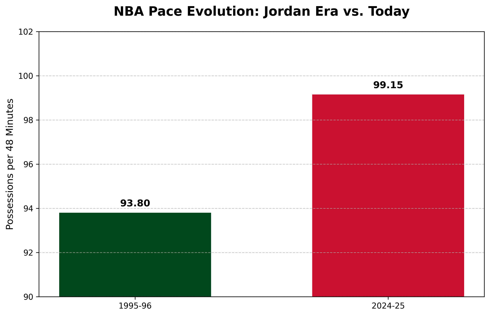

# NBA Game Intensity & Durability Analysis

### Project Overview
This project investigates the evolution of NBA game intensity and its potential impact on player durability. By comparing the "Jordan Era" (1995-96) with the **Current Season (2024-25)**, I analyzed the change in game pace and player workload.

### Key Findings (Updated for 2024-25)
- **Historical Pace Gap:** There is a significant and sustained increase in game intensity.
- **1995-96 Season (Calculated):** 93.80 Pace
- **2024-25 Season (Current):** 100.61 Pace
- **Trend:** The modern game remains significantly faster than the 90s, requiring athletes to perform more high-intensity actions per minute of play.

### Technical Challenges Overcome
- **Data Recovery:** Resolved `NaN` issues for historical seasons in the NBA API by implementing a manual Pace calculation formula: `Possessions = FGA + 0.44 * FTA - OREB + TOV`.
- **Dynamic Analysis:** Updated the pipeline to fetch and process live data from the ongoing 2024-25 season.
- **API Handling:** Utilized the `leagueleaders` endpoint for consistent data integrity across different eras.

### Tech Stack
- **Python 3.10**
- **Pandas** (Data Manipulation)
- **NBA_API** (Data Sourcing)