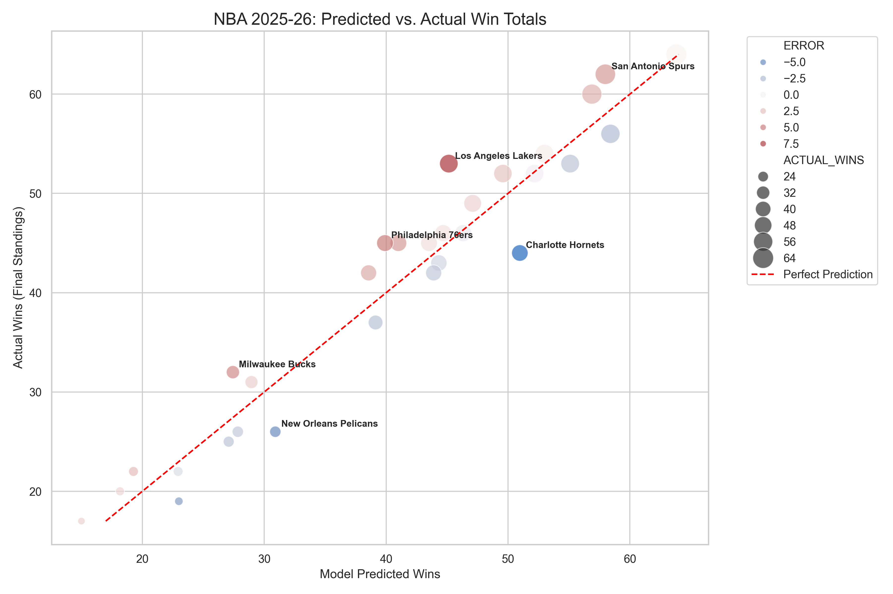

# NBA Win-Prediction Engine (2025-26 Season)

A machine learning pipeline that predicts NBA team success using advanced efficiency metrics and historical performance data.

## 📊 Model Performance Analysis
This model uses Linear Regression to predict season win totals based on Net Rating, Pace, and Offensive/Defensive Efficiency.

### Key Insights:
* **The "Perfect" Predictions:** The model was exceptionally accurate for the **OKC Thunder** (Error: 0.19) and **Houston Rockets** (Error: -0.18).
* **The Outliers:** 
    * **LA Lakers (+7.86):** Significantly over-performed their statistical profile, likely due to high "clutch" win rates.
    * **Charlotte Hornets (-6.97):** Under-performed relative to their efficiency metrics, suggesting a gap between statistical potential and late-game execution.

## 🛠️ Tech Stack
* **Language:** Python 3.10
* **Data Source:** `nba_api` (Official NBA Stats)
* **Machine Learning:** Scikit-Learn (Linear Regression)
* **Visualization:** Seaborn & Matplotlib
* **Architecture:** Modular Class-based design